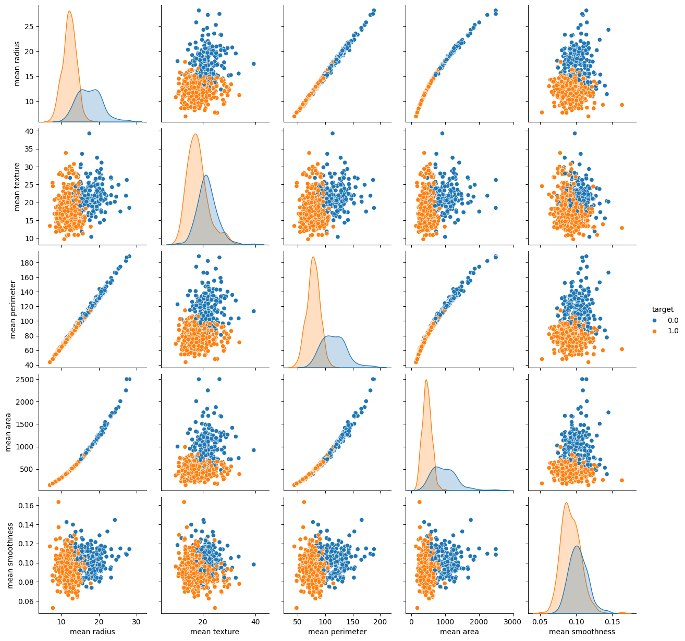
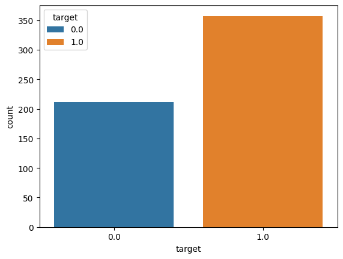
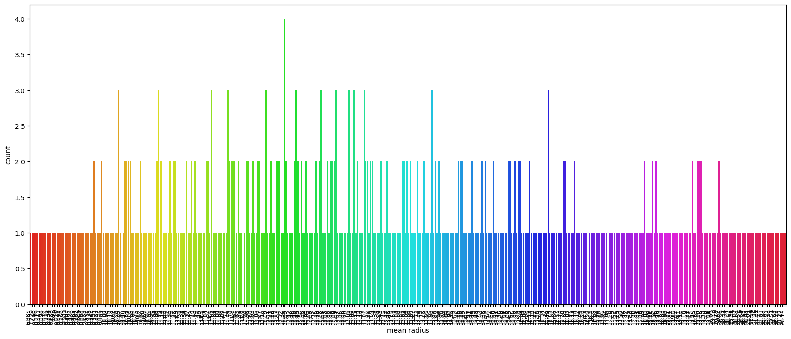
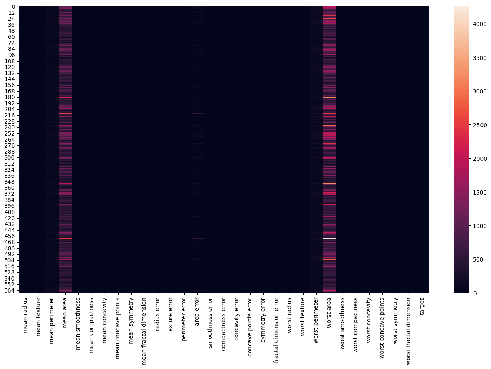
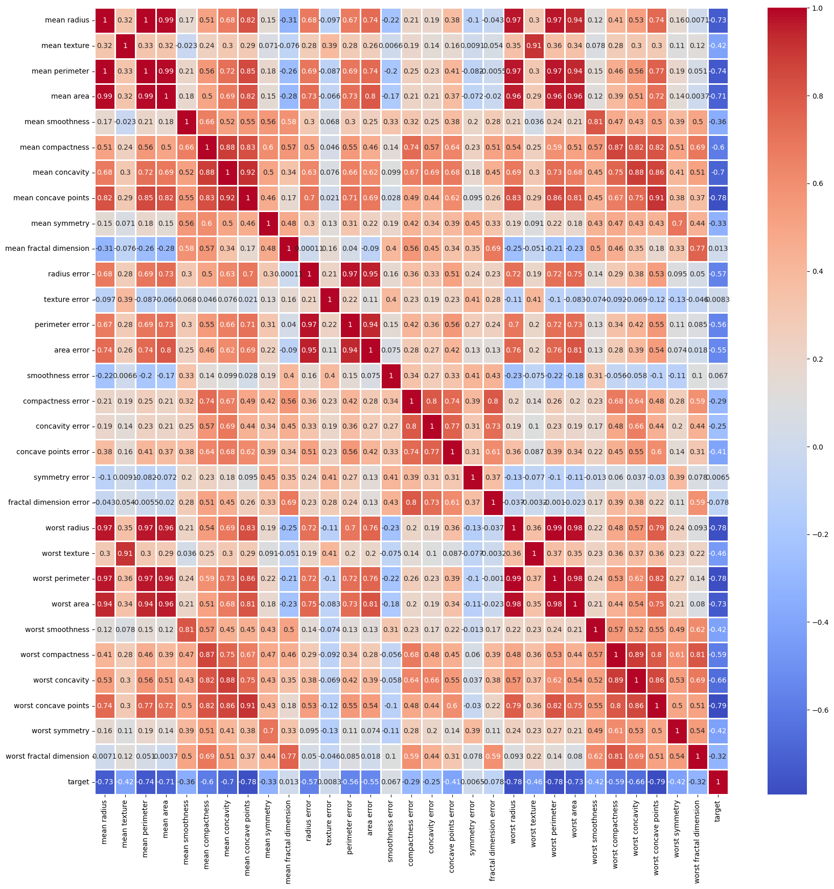
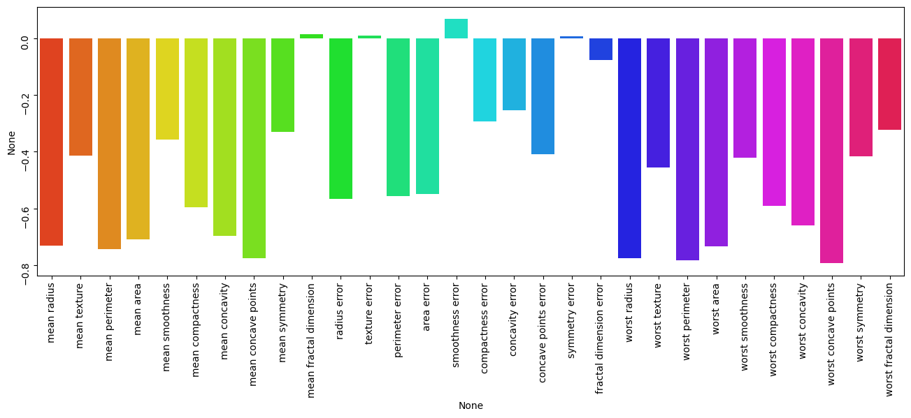

# Breast Cancer Classification Project

This project involves the classification of breast cancer using various machine learning techniques. The dataset used contains several features extracted from breast cancer cell images.

## Table of Contents

- [Breast Cancer Classification Project](#breast-cancer-classification-project)
  - [Table of Contents](#table-of-contents)
  - [Introduction](#introduction)
  - [Dataset](#dataset)
  - [Exploratory Data Analysis](#exploratory-data-analysis)
    - [Pair Plot](#pair-plot)
    - [Count Plot](#count-plot)
    - [Distribution of Mean Radius](#distribution-of-mean-radius)
    - [Heatmap](#heatmap)
    - [Correlation Matrix](#correlation-matrix)
    - [Feature Importance](#feature-importance)
  - [Model Building](#model-building)
  - [Evaluation](#evaluation)
  - [Conclusion](#conclusion)

## Introduction

Breast cancer is a significant health issue affecting millions of people worldwide. Early detection and classification are crucial for effective treatment. This project aims to classify breast cancer tumors as benign or malignant based on various features extracted from cell images.

## Dataset

The dataset used in this project is the Breast Cancer Wisconsin (Diagnostic) Data Set. It contains 569 samples with 30 features each, along with a target variable indicating whether the tumor is benign or malignant.

## Exploratory Data Analysis

### Pair Plot

The pair plot below shows the relationships between different features in the dataset. Each point represents a sample, colored according to the target variable.

### Count Plot

The count plot below shows the distribution of the target variable, indicating the number of benign and malignant cases.

### Distribution of Mean Radius

The distribution plot below shows the frequency distribution of the mean radius feature.

### Heatmap

The heatmap below visualizes the distribution of the feature values across the samples.

### Correlation Matrix

The correlation matrix below shows the correlation coefficients between different features. Highly correlated features are highlighted in red.

### Feature Importance

The bar plot below shows the importance of each feature in the classification task.

## Model Building

We implemented several machine learning models to classify breast cancer tumors, including:

- Logistic Regression
- Decision Tree
- Random Forest
- Support Vector Machine
- K-Nearest Neighbors

## Evaluation

The models were evaluated using various metrics such as accuracy, precision, recall, and F1-score. The performance of each model was compared to select the best-performing one.

## Conclusion

The project successfully classified breast cancer tumors with high accuracy using the selected machine learning models. The findings highlight the importance of certain features in the classification task, providing insights into the characteristics of benign and malignant tumors.

